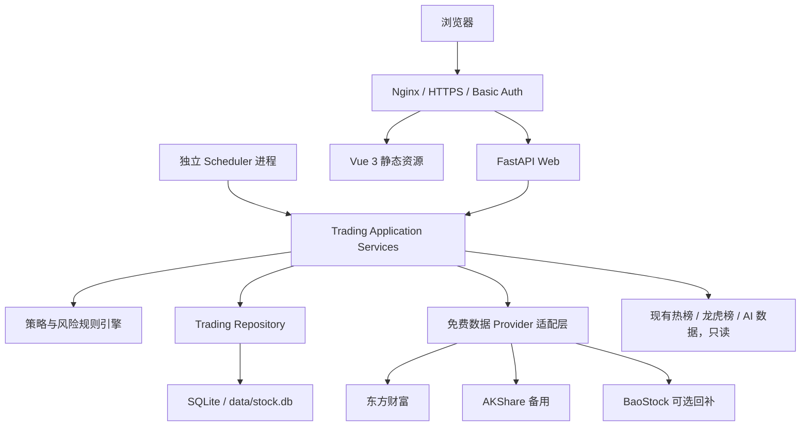

# StockPulse 交易决策系统设计规格

> 基于 `D:\my-projects\stock-analysis-hub` 增量开发  
> 文档版本：1.0  
> 日期：2026-07-21  
> 状态：待用户评审；评审通过后可进入实施计划与开发  
> 适用范围：A 股、日线波段、收盘后生成下一交易日条件计划、人工确认执行

---

## 1. 执行摘要

本项目不另建仓库，而是在现有 `stock-analysis-hub` 中新增边界清晰的“交易决策”模块。新模块复用现有 Vue 3、FastAPI、Docker、SQLite、热榜、龙虎榜、股池跟踪、回测和 AI 分析能力，同时避免继续向现有的 `backend/main.py` 与 `backend/database.py` 堆叠职责。

系统由用户维护股票池、账户、持仓与实际成交。交易日收盘后，系统使用免费数据接口更新行情，执行数据质量门禁、市场状态判断、股票评分、条件信号生成、组合风控和仓位计算，最终生成下一交易日的可执行计划。计划只包含条件操作，不预测确定性涨跌，也不连接券商自动下单。

第一阶段面向单用户和指定股池，在现有 SQLite 数据库中新增 `trade_` 前缀表，通过独立 Repository 访问。部署继续使用 Docker Compose。公网部署默认通过 Nginx、HTTPS 和 Basic Auth 保护整个站点。未来出现多用户、全市场多年行情、高并发或券商自动交易需求时，再评估 PostgreSQL 与独立服务拆分。

### 1.1 核心决策

| 决策项 | 结论 |
|---|---|
| 项目形态 | 在现有仓库中新增独立业务模块 |
| 前端 | 复用 Vue 3 + TypeScript + Vite + ECharts |
| 后端 | 复用 FastAPI，新增 `/api/trading/*` Router |
| 数据库 | 第一阶段继续 SQLite，新增 `trade_` 前缀表 |
| 行情 | 免费多源适配：东方财富为主、AKShare 备用、BaoStock 可选回补 |
| 运行周期 | 交易日收盘后生成下一交易日计划 |
| 执行方式 | 人工确认、人工下单；不接券商自动交易 |
| 核心策略 | 硬规则负责市场过滤、入场、退出和风控；评分模型负责排序 |
| AI 定位 | 只解释确定性结果，不得修改规则引擎输出 |
| 部署 | Docker Compose；Web 与 Scheduler 分离运行 |
| 安全 | 公网必须 HTTPS + Basic Auth；敏感配置只放环境变量 |

---

## 2. 现有项目评估

### 2.1 可直接复用

- FastAPI Web 后端与统一启动入口。
- Vue 3 前端、暗色主题、中文界面和 ECharts 图表能力。
- Docker 多阶段构建和 `data` 持久化卷。
- 东方财富免费接口访问代码与 AKShare 备用适配经验。
- 热榜、龙虎榜、板块标签、信号股、D1-D30 跟踪数据。
- 每日复盘、智能选股、信号诊断和 AI 历史记录。
- Pytest API、数据库及解析测试基础。

### 2.2 必须控制的技术债

- `backend/main.py` 约 690 行，API 路由集中，新增交易接口必须使用 `APIRouter`。
- `backend/database.py` 约 1056 行，包含建表、迁移、查询与部分外部请求；交易模块不得继续写入该类。
- 当前 `/preview` 与 `/admin` 仅是显示逻辑，不构成身份认证。
- 现有后台任务依赖进程内执行和外部 cron；新任务应有独立调度进程，避免 Web 多 worker 时重复运行。
- AKShare 备用代码已存在，但依赖尚未进入 `requirements.txt`。
- 当前工作区存在 29 项修改或未跟踪内容。开始实施前必须先保护现有改动，并建立独立开发分支或工作区。

### 2.3 本次增量开发原则

1. 现有热榜、龙虎榜和 AI 数据只读复用，不改变其原有计算语义。
2. 新代码全部进入独立模块，旧入口只增加 Router 注册和前端导航入口。
3. 所有计划必须能够按数据版本、股票池版本、策略版本重放。
4. 数据异常时优先停止建议，不以陈旧或不完整数据“凑出”结论。
5. 交易规则先确定性、后智能化；AI 文本不得成为买卖信号的唯一来源。

---

## 3. 产品目标与边界

### 3.1 产品目标

- 将“凭感觉交易”转化为可重复、可解释、可统计的条件决策流程。
- 用户给出股票池后，系统每日生成下一交易日操作计划。
- 对现有持仓优先给出风险处理，再对候选股票给出新开仓建议。
- 自动计算仓位、初始止损、最大风险、组合暴露和行业集中度。
- 保存计划、实际执行和后续结果，区分策略问题与执行问题。
- 提供无未来函数的历史回测和小仓位验证指标。
- 可直接部署到个人服务器，通过浏览器使用。

### 3.2 第一阶段范围

- A 股普通股票与主要宽基指数。
- 日线数据与收盘后决策。
- 单用户、单主账户；数据模型保留多账户字段。
- 股票池手动录入及 CSV/XLSX 导入。
- 账户、持仓、成交记录管理。
- 免费行情采集、缓存、校验和数据健康页面。
- 市场状态、股票评分、条件买入、持有、减仓、清仓与禁止交易。
- 策略参数版本化、计划版本化和审计日志。
- 回测、交易复盘和核心统计指标。
- Docker Compose 部署、定时运行、备份和健康检查。

### 3.3 明确不做

- 不进行分钟级、高频、打板或盘口交易。
- 不预测单只股票明日必涨或收益率。
- 不直接连接券商、自动委托或自动撤单。
- 不使用融资、融券、期权或其他杠杆产品。
- 不在第一阶段做多用户 SaaS、订阅计费和复杂角色权限。
- 不依赖付费行情或必须付费的第三方服务。
- 不让大语言模型直接生成未经过规则校验的买卖价格。

### 3.4 成功标准

- 每条操作建议都有规则命中、输入数据时间和策略版本。
- 同一输入、同一版本重复运行得到完全一致的计划。
- 数据不满足门禁时，不产生新开仓建议。
- 仓位和组合风险永远不突破已配置上限。
- 完成至少 100 笔历史样本回测和 30 笔模拟或小仓位验证。
- 用户能够回答每一笔交易“为什么买、何时错、最多亏多少、为什么卖”。

---

## 4. 用户角色与核心流程

### 4.1 用户角色

第一阶段只有一个受保护的管理员用户。该用户可以维护账户、股票池、策略参数、持仓与成交，也可以生成和发布计划。只读预览仍可保留，但必须与整个站点一同受 Nginx 身份认证保护。

### 4.2 首次配置流程

1. 登录 Web 系统。
2. 创建或确认主账户，录入初始资金和风险偏好。
3. 导入股票池。
4. 录入当前持仓、成本、数量与可卖数量。
5. 检查免费数据源状态并完成历史数据回补。
6. 选择并启用一个策略版本。
7. 执行首次数据校验和试运行。
8. 计划结果经人工检查后再启用每日定时任务。

### 4.3 每日闭环


---

## 5. 总体架构



### 5.1 运行进程

| 进程 | 职责 | 约束 |
|---|---|---|
| `web` | 提供 API、静态页面和人工触发入口 | 不承担定时调度 |
| `scheduler` | 定时更新数据、生成计划、备份 | 单实例；同一交易日任务互斥 |
| `nginx` | TLS、Basic Auth、反向代理 | 公网部署必需 |

`web` 与 `scheduler` 使用同一个 Docker 镜像并挂载同一 `data` 卷。SQLite 必须启用 WAL、busy timeout 和短事务。第一阶段 Web 仅运行一个 Uvicorn worker，避免无必要的 SQLite 写竞争。

---

## 6. 目标代码结构

```text
backend/
├─ main.py                         # 仅注册 trading_router
├─ config.py                       # 增加交易模块环境配置
├─ trading/
│  ├─ __init__.py
│  ├─ router.py                    # /api/trading/*
│  ├─ schemas.py                   # Pydantic 请求/响应模型
│  ├─ errors.py                    # 领域错误和 API 错误码
│  ├─ repository.py                # 仅负责 trade_ 表
│  ├─ migrations.py                # 独立、幂等的 trade_ 表迁移
│  ├─ clock.py                     # 交易日与时区抽象，便于测试
│  ├─ services/
│  │  ├─ account_service.py
│  │  ├─ pool_service.py
│  │  ├─ market_data_service.py
│  │  ├─ indicator_service.py
│  │  ├─ plan_service.py
│  │  ├─ portfolio_service.py
│  │  ├─ backtest_service.py
│  │  └─ review_service.py
│  ├─ strategies/
│  │  ├─ base.py
│  │  ├─ market_regime.py
│  │  ├─ scoring.py
│  │  ├─ entry_rules.py
│  │  ├─ exit_rules.py
│  │  └─ position_sizing.py
│  ├─ providers/
│  │  ├─ base.py
│  │  ├─ eastmoney.py
│  │  ├─ akshare.py
│  │  ├─ baostock.py
│  │  └─ composite.py
│  └─ jobs/
│     ├─ scheduler.py
│     ├─ update_market_data.py
│     ├─ generate_daily_plan.py
│     └─ backup_database.py
│
frontend/src/
├─ views/
│  └─ TradingView.vue              # 交易决策主入口
├─ components/trading/
│  ├─ TradingDashboard.vue
│  ├─ AccountPanel.vue
│  ├─ StockPoolPanel.vue
│  ├─ PortfolioPanel.vue
│  ├─ DailyPlanPanel.vue
│  ├─ PlanItemDrawer.vue
│  ├─ BacktestPanel.vue
│  ├─ DataHealthPanel.vue
│  └─ StrategySettingsPanel.vue
├─ composables/
│  └─ useTradingApi.ts
└─ types/
   └─ trading.ts

tests/
├─ trading/
│  ├─ test_market_regime.py
│  ├─ test_scoring.py
│  ├─ test_position_sizing.py
│  ├─ test_entry_exit_rules.py
│  ├─ test_data_quality.py
│  ├─ test_plan_service.py
│  ├─ test_backtest_no_lookahead.py
│  └─ test_trading_api.py
└─ fixtures/trading/
   ├─ daily_bars.json
   └─ provider_responses/
```

禁止事项：不得把新的交易 API 直接继续写入 `backend/main.py`，不得把新的交易 SQL 继续写入现有 `Database` 类，不得让 Provider 直接修改计划表。

---

## 7. 免费行情数据设计

### 7.1 Provider 接口

所有第三方数据必须先经过统一接口，不允许业务服务直接调用网页接口。

```python
class MarketDataProvider(Protocol):
    def get_trade_calendar(self, start: date, end: date) -> list[TradeDay]: ...
    def get_instruments(self) -> list[Instrument]: ...
    def get_daily_bars(self, codes: list[str], start: date, end: date) -> list[DailyBar]: ...
    def get_index_bars(self, codes: list[str], start: date, end: date) -> list[DailyBar]: ...
    def get_instrument_status(self, codes: list[str], trade_date: date) -> list[InstrumentStatus]: ...
    def get_sector_membership(self, codes: list[str]) -> list[SectorMembership]: ...
```

### 7.2 数据源优先级

| 数据类型 | 主源 | 备用源 | 处理方式 |
|---|---|---|---|
| 股票及指数日线 | 东方财富 | AKShare | 主源失败后切换；落库缓存 |
| 交易日历 | AKShare | BaoStock | 每月提前刷新；人工可重建 |
| 停复牌、ST、退市状态 | 东方财富/AKShare | 人工风险标记 | 持仓缺失时阻断计划 |
| 板块映射 | 复用现有东方财富数据 | AKShare | 允许延迟，不影响止损 |
| 历史批量回补 | AKShare | BaoStock | 限速、断点续传 |
| 热榜及龙虎榜 | 复用现有项目 | 无 | 只作为辅助评分，不是核心行情 |

免费数据源没有可用性保证，接口字段、访问频率和使用条款可能变化。系统必须记录来源、抓取时间、原始交易日、校验结果和响应摘要。任何数据源切换不得改变领域模型。

### 7.3 规范化日线模型

```text
stock_code, trade_date,
open, high, low, close,
volume, amount,
pre_close, change_pct,
adjust_factor,
source, fetched_at, checksum
```

- 指标计算使用前复权序列。
- 计划价格和成交复盘使用原始价格。
- 除权除息日必须保存复权因子，禁止把复权跳变当成真实盈亏。
- 金额统一为人民币元，成交量统一为股。
- 股票代码在领域层统一为 `000001.SZ`、`600000.SH` 形式；调用现有接口时再转换。

### 7.4 数据质量门禁

计划生成前执行以下检查：

1. 基准指数与所有当前持仓必须 100% 更新到目标交易日。
2. 股票池缺失比例不超过 5%；缺失股票被标记 `DATA_UNAVAILABLE` 并排除。
3. 缺失比例超过 5%、基准缺失或任一持仓缺失时，整个计划状态为 `BLOCKED`。
4. OHLC 必须满足 `low <= open/close <= high`，价格和成交量不得为负。
5. 同一股票同一交易日只能存在一条规范化行情。
6. 关键价格跨源偏差超过 0.5% 时标记冲突；持仓或候选股发生冲突时禁止给出新操作。
7. 数据日期晚于系统日期、交易日重复或复权因子异常时阻断计划。
8. 非关键板块或辅助信号缺失时，允许状态为 `PARTIAL`，但报告必须显式提示。

### 7.5 缓存与限流

- 日线行情只做增量抓取，默认回看 10 个交易日覆盖修订数据。
- Provider 采用指数退避，最多重试 3 次；不同数据源的重试互不嵌套。
- 单源失败后进入短暂熔断，避免连续请求触发封禁。
- 批量回补按股票分片，每个分片完成后提交并保存游标。
- 测试中禁止访问真实免费接口，统一使用固定响应 fixture。

---

## 8. 策略与交易规则

### 8.1 设计原则

- 所有规则来自版本化参数，不在代码中散落魔法数字。
- 先处理持仓风险，再计算新开仓。
- 评分只决定候选优先级，不能绕过硬性风控。
- 每个信号必须返回 `rule_hits`、`rule_misses` 和 `invalidation_reason`。
- 第一版只启用一个默认策略，避免用户在未积累样本前频繁切换。

### 8.2 默认参数

| 参数 | 默认值 | 说明 |
|---|---:|---|
| 单笔账户风险 | 0.5% | 以当前账户净值计算 |
| 单只股票仓位上限 | 15% | 取仓位公式与该上限的较小值 |
| 总仓位上限 | 60% | 进攻状态上限 |
| 中性市场仓位上限 | 40% | 减少新开仓 |
| 防守市场仓位上限 | 20% | 不开新仓，仅管理持仓 |
| 最大持仓数量 | 5 | 含尚未完全卖出的持仓 |
| 同行业仓位上限 | 30% | 行业缺失时按未知行业统一计算 |
| 连续亏损降风险阈值 | 3 笔 | 之后单笔风险降至 0.25% |
| 账户回撤暂停阈值 | 8% | 暂停新开仓，人工复盘后恢复 |
| 最低候选评分 | 70/100 | 评分不足只允许观察 |
| 最小止损距离 | 3% | 过近时扩展到 3% |
| 最大止损距离 | 10% | 超过则放弃交易 |
| 次日追高上限 | 触发价上方 3% | 超出则不买 |

参数修改会创建新的策略版本，不允许覆盖已用于历史计划的版本。

### 8.3 股票池硬过滤

满足任一条件时输出 `禁止交易`：

- ST、*ST、退市整理、暂停上市或非普通 A 股。
- 停牌或目标交易日无有效行情。
- 上市不足 60 个交易日。
- 近 20 日平均成交额低于配置阈值，默认 3000 万元。
- 近 20 日存在无法解释的数据缺口或复权异常。
- 无法形成 3%-10% 范围内的合理初始止损。
- 当前价格处于不可成交的一字涨跌停状态。
- 被用户加入人工风险黑名单。

### 8.4 市场状态

默认基准为沪深 300，可配置增加中证 500。使用收盘后已知数据计算：

```text
M1 = 基准收盘价 > MA20                    -> +1
M2 = 基准 MA20 > MA60                     -> +1
M3 = 全市场有效股票中收盘价 > MA20 的比例 >= 55% -> +1
M4 = 基准 20 日实现波动率处于近 252 日 80% 分位以上 -> -1
M5 = 基准收盘价 < MA60                    -> -1

market_score = M1 + M2 + M3 + M4 + M5
```

| `market_score` | 状态 | 新开仓 | 总仓位上限 |
|---:|---|---|---:|
| `>= 2` | `ATTACK` 进攻 | 允许 | 60% |
| `0..1` | `NEUTRAL` 中性 | 允许但降仓 | 40% |
| `<= -1` | `DEFENSE` 防守 | 禁止 | 20% |

全市场宽度数据缺失时可以降级为仅使用基准指数，但市场状态必须标记 `degraded=true`，新开仓风险比例自动减半。

### 8.5 股票评分

总分 100，所有输入只能来自信号日收盘前可知数据。

| 维度 | 分值 | 规则 |
|---|---:|---|
| 中期趋势 | 30 | 收盘高于 MA20：10；MA20 高于 MA60：10；MA60 斜率为正：10 |
| 短期动量 | 20 | 股票池内 20 日收益分位数映射为 0-20 分，极端单日拉升触发扣分 |
| 量价结构 | 20 | 收盘距离前 20 日高点不超过 2%：10；量比处于 1.0-2.5：10 |
| 波动风险 | 15 | ATR14/收盘价处于 2%-6%：10；近 20 日无异常跳空或连续一字板：5 |
| 相对强弱 | 15 | 20 日超额收益为正：8；60 日超额收益为正：7 |

辅助信号只能加分，合计上限 10 分，且总分仍封顶 100：

- 当日或近期热榜趋势增强。
- 龙虎榜有效信号。
- 现有信号回测样本量与胜率达到配置门槛。

AI 推荐星级不进入确定性评分。

### 8.6 入场规则

同时满足以下条件才生成 `条件买入`：

1. 市场状态不是 `DEFENSE`。
2. 股票通过硬过滤且评分不低于 70。
3. 收盘价位于前 20 日最高价下方 2%以内，或当日刚完成有效突破。
4. 量价条件达到配置要求。
5. 组合仍有持仓数量、总仓位和行业额度。
6. 计算出的止损距离在 3%-10% 内。

次日触发价：

```text
breakout_level = 前 20 日最高价
trigger_price = max(breakout_level, 信号日最高价) + 最小价格变动单位
do_not_chase_price = trigger_price * 1.03
```

若次日开盘高于 `do_not_chase_price`、全天未触发、停牌或无法成交，则计划自动视为 `NOT_FILLED`，不得追单。

### 8.7 初始止损与仓位

```text
raw_stop = max(近 10 日最低价, 计划入场价 - 2 * ATR14)
stop_distance_pct = (计划入场价 - raw_stop) / 计划入场价
```

- 距离小于 3% 时，将止损扩展为入场价下方 3%。
- 距离大于 10% 时，不生成买入计划。
- 止损价按 A 股价格精度向下取整。

```text
risk_budget = 账户净值 * 有效单笔风险比例
risk_quantity = floor(risk_budget / (entry_price - stop_price) / 100) * 100
cap_quantity = floor((账户净值 * 单股仓位上限) / entry_price / 100) * 100
buy_quantity = min(risk_quantity, cap_quantity, 现金及组合额度允许数量)
```

`buy_quantity < 100` 时不生成买入。连续亏损、数据降级或中性市场可以叠加降低风险，但有效单笔风险不低于 0.1%，也不能高于配置上限。

### 8.8 持仓与退出规则

卖出判断优先级固定：

1. 证券风险事件或人工强制退出。
2. 初始止损。
3. 移动止损。
4. 趋势失效。
5. 分批止盈。
6. 组合再平衡。

默认规则：

- 移动止损：`max(上一日移动止损, 持仓以来最高收盘价 - 2.5 * ATR14)`。
- 趋势退出：连续 2 日收盘低于 MA20，或单日收盘低于 MA60。
- 达到 `+2R` 时建议卖出三分之一，剩余仓位继续使用移动止损。
- A 股 T+1：买入当日不得生成可执行卖出数量；系统保存 `available_quantity`。
- 涨跌停或停牌造成无法卖出时，状态标记为 `EXIT_BLOCKED`，风险报告仍按待退出持仓计算。

### 8.9 统一操作状态

| 状态 | 含义 |
|---|---|
| `CONDITIONAL_BUY` | 次日满足价格、成交和风险条件才买入 |
| `WATCH` | 评分较高但入场条件未完整成立 |
| `HOLD` | 持仓规则未触发退出 |
| `REDUCE` | 分批止盈、风险降低或组合再平衡 |
| `EXIT` | 止损、趋势失效或风险事件要求退出 |
| `FORBIDDEN` | 数据、证券状态或风控不允许交易 |

---

## 9. 计划生成与状态机

### 9.1 生成顺序

1. 锁定目标交易日、股票池版本、策略版本和账户快照。
2. 更新行情并运行数据质量门禁。
3. 计算市场状态和建议总仓位。
4. 对当前持仓生成退出、减仓或持有建议。
5. 计算股票池指标、评分和入场候选。
6. 按评分降序分配剩余风险预算。
7. 计算触发价、止损价、数量和最大损失。
8. 运行组合级二次校验。
9. 固化计划快照并生成摘要。
10. 用户审核后发布；发布后不可编辑，只能创建新版本。

### 9.2 状态机

```text
CREATED -> VALIDATING -> GENERATING -> READY -> PUBLISHED
                  |           |          |
                  v           v          v
               BLOCKED      FAILED    SUPERSEDED

READY 可因非关键数据缺失标记为 PARTIAL；PARTIAL 发布前必须人工确认。
```

### 9.3 幂等键

```text
run_key = SHA256(
  signal_date + account_snapshot_hash + stock_pool_version_hash
  + strategy_version_hash + canonical_data_hash
)
```

同一 `run_key` 重复请求必须返回已有计划。输入变化时创建新计划并将旧计划标记 `SUPERSEDED`，不得原地覆盖。

---

## 10. 数据库设计

### 10.1 通用约定

- 所有日期使用 `YYYY-MM-DD`，时间使用带时区的 ISO 8601 字符串。
- 金额和价格在第一阶段使用 SQLite `REAL`，API 层通过 Decimal 量化到合法精度；迁移 PostgreSQL 时使用 `NUMERIC`。
- JSON 字段在 SQLite 中存为 `TEXT`，写入前使用稳定键排序，便于计算哈希。
- 所有外键开启 `PRAGMA foreign_keys=ON`。
- 连接开启 `journal_mode=WAL`、`busy_timeout=5000`。

### 10.2 核心 DDL

```sql
CREATE TABLE IF NOT EXISTS trade_accounts (
    id INTEGER PRIMARY KEY AUTOINCREMENT,
    name TEXT NOT NULL UNIQUE,
    initial_equity REAL NOT NULL CHECK (initial_equity > 0),
    cash_balance REAL NOT NULL CHECK (cash_balance >= 0),
    risk_per_trade REAL NOT NULL DEFAULT 0.005,
    max_single_position REAL NOT NULL DEFAULT 0.15,
    max_total_exposure REAL NOT NULL DEFAULT 0.60,
    max_sector_exposure REAL NOT NULL DEFAULT 0.30,
    max_positions INTEGER NOT NULL DEFAULT 5,
    max_drawdown_limit REAL NOT NULL DEFAULT 0.08,
    is_active INTEGER NOT NULL DEFAULT 1,
    created_at TEXT NOT NULL,
    updated_at TEXT NOT NULL
);

CREATE TABLE IF NOT EXISTS trade_strategy_versions (
    id INTEGER PRIMARY KEY AUTOINCREMENT,
    strategy_code TEXT NOT NULL,
    version_no INTEGER NOT NULL,
    name TEXT NOT NULL,
    params_json TEXT NOT NULL,
    params_hash TEXT NOT NULL,
    status TEXT NOT NULL CHECK (status IN ('DRAFT','ACTIVE','RETIRED')),
    created_at TEXT NOT NULL,
    activated_at TEXT,
    UNIQUE(strategy_code, version_no),
    UNIQUE(params_hash)
);

CREATE TABLE IF NOT EXISTS trade_stock_pool_versions (
    id INTEGER PRIMARY KEY AUTOINCREMENT,
    pool_name TEXT NOT NULL,
    version_no INTEGER NOT NULL,
    items_hash TEXT NOT NULL,
    source TEXT NOT NULL,
    created_at TEXT NOT NULL,
    UNIQUE(pool_name, version_no),
    UNIQUE(pool_name, items_hash)
);

CREATE TABLE IF NOT EXISTS trade_stock_pool_items (
    pool_version_id INTEGER NOT NULL,
    stock_code TEXT NOT NULL,
    stock_name TEXT,
    sector_name TEXT,
    manual_blacklist INTEGER NOT NULL DEFAULT 0,
    note TEXT,
    PRIMARY KEY (pool_version_id, stock_code),
    FOREIGN KEY (pool_version_id) REFERENCES trade_stock_pool_versions(id)
);

CREATE TABLE IF NOT EXISTS trade_daily_bars (
    stock_code TEXT NOT NULL,
    trade_date TEXT NOT NULL,
    open REAL NOT NULL,
    high REAL NOT NULL,
    low REAL NOT NULL,
    close REAL NOT NULL,
    volume REAL NOT NULL,
    amount REAL,
    pre_close REAL,
    change_pct REAL,
    adjust_factor REAL,
    source TEXT NOT NULL,
    fetched_at TEXT NOT NULL,
    checksum TEXT NOT NULL,
    PRIMARY KEY (stock_code, trade_date)
);

CREATE INDEX IF NOT EXISTS idx_trade_daily_bars_date
ON trade_daily_bars(trade_date);

CREATE TABLE IF NOT EXISTS trade_positions (
    id INTEGER PRIMARY KEY AUTOINCREMENT,
    account_id INTEGER NOT NULL,
    stock_code TEXT NOT NULL,
    stock_name TEXT,
    quantity INTEGER NOT NULL CHECK (quantity >= 0),
    available_quantity INTEGER NOT NULL CHECK (available_quantity >= 0),
    average_cost REAL NOT NULL CHECK (average_cost >= 0),
    initial_stop REAL,
    trailing_stop REAL,
    opened_at TEXT,
    updated_at TEXT NOT NULL,
    UNIQUE(account_id, stock_code),
    FOREIGN KEY (account_id) REFERENCES trade_accounts(id)
);

CREATE TABLE IF NOT EXISTS trade_executions (
    id INTEGER PRIMARY KEY AUTOINCREMENT,
    account_id INTEGER NOT NULL,
    plan_item_id INTEGER,
    stock_code TEXT NOT NULL,
    side TEXT NOT NULL CHECK (side IN ('BUY','SELL')),
    trade_date TEXT NOT NULL,
    price REAL NOT NULL CHECK (price > 0),
    quantity INTEGER NOT NULL CHECK (quantity > 0),
    commission REAL NOT NULL DEFAULT 0,
    tax REAL NOT NULL DEFAULT 0,
    note TEXT,
    created_at TEXT NOT NULL,
    FOREIGN KEY (account_id) REFERENCES trade_accounts(id),
    FOREIGN KEY (plan_item_id) REFERENCES trade_plan_items(id)
);

CREATE INDEX IF NOT EXISTS idx_trade_executions_account_date
ON trade_executions(account_id, trade_date);

CREATE TABLE IF NOT EXISTS trade_plan_runs (
    id INTEGER PRIMARY KEY AUTOINCREMENT,
    run_key TEXT NOT NULL UNIQUE,
    account_id INTEGER NOT NULL,
    signal_date TEXT NOT NULL,
    target_trade_date TEXT NOT NULL,
    stock_pool_version_id INTEGER NOT NULL,
    strategy_version_id INTEGER NOT NULL,
    status TEXT NOT NULL,
    market_regime TEXT,
    market_score INTEGER,
    recommended_exposure REAL,
    account_snapshot_json TEXT NOT NULL,
    data_snapshot_hash TEXT NOT NULL,
    warnings_json TEXT NOT NULL DEFAULT '[]',
    error_json TEXT,
    created_at TEXT NOT NULL,
    published_at TEXT,
    superseded_by_id INTEGER,
    FOREIGN KEY (account_id) REFERENCES trade_accounts(id),
    FOREIGN KEY (stock_pool_version_id) REFERENCES trade_stock_pool_versions(id),
    FOREIGN KEY (strategy_version_id) REFERENCES trade_strategy_versions(id)
);

CREATE INDEX IF NOT EXISTS idx_trade_plan_runs_signal_date
ON trade_plan_runs(signal_date, status);

CREATE TABLE IF NOT EXISTS trade_plan_items (
    id INTEGER PRIMARY KEY AUTOINCREMENT,
    plan_run_id INTEGER NOT NULL,
    stock_code TEXT NOT NULL,
    stock_name TEXT,
    action TEXT NOT NULL,
    score REAL,
    rank_no INTEGER,
    trigger_price REAL,
    do_not_chase_price REAL,
    stop_price REAL,
    target_2r_price REAL,
    suggested_quantity INTEGER NOT NULL DEFAULT 0,
    suggested_position_pct REAL NOT NULL DEFAULT 0,
    risk_amount REAL NOT NULL DEFAULT 0,
    risk_pct REAL NOT NULL DEFAULT 0,
    rule_hits_json TEXT NOT NULL DEFAULT '[]',
    rule_misses_json TEXT NOT NULL DEFAULT '[]',
    invalidation_reason TEXT,
    execution_status TEXT NOT NULL DEFAULT 'PENDING',
    created_at TEXT NOT NULL,
    UNIQUE(plan_run_id, stock_code),
    FOREIGN KEY (plan_run_id) REFERENCES trade_plan_runs(id)
);

CREATE TABLE IF NOT EXISTS trade_equity_snapshots (
    account_id INTEGER NOT NULL,
    trade_date TEXT NOT NULL,
    cash REAL NOT NULL,
    market_value REAL NOT NULL,
    total_equity REAL NOT NULL,
    exposure REAL NOT NULL,
    peak_equity REAL NOT NULL,
    drawdown REAL NOT NULL,
    created_at TEXT NOT NULL,
    PRIMARY KEY (account_id, trade_date),
    FOREIGN KEY (account_id) REFERENCES trade_accounts(id)
);

CREATE TABLE IF NOT EXISTS trade_data_issues (
    id INTEGER PRIMARY KEY AUTOINCREMENT,
    run_id INTEGER,
    stock_code TEXT,
    trade_date TEXT,
    severity TEXT NOT NULL CHECK (severity IN ('INFO','WARNING','BLOCKING')),
    issue_code TEXT NOT NULL,
    message TEXT NOT NULL,
    source TEXT,
    details_json TEXT NOT NULL DEFAULT '{}',
    created_at TEXT NOT NULL,
    resolved_at TEXT,
    FOREIGN KEY (run_id) REFERENCES trade_plan_runs(id)
);

CREATE TABLE IF NOT EXISTS trade_jobs (
    id INTEGER PRIMARY KEY AUTOINCREMENT,
    job_type TEXT NOT NULL,
    job_key TEXT NOT NULL UNIQUE,
    status TEXT NOT NULL CHECK (status IN ('QUEUED','RUNNING','SUCCEEDED','FAILED','CANCELLED')),
    progress REAL NOT NULL DEFAULT 0,
    request_json TEXT NOT NULL DEFAULT '{}',
    result_json TEXT,
    error_json TEXT,
    attempts INTEGER NOT NULL DEFAULT 0,
    created_at TEXT NOT NULL,
    started_at TEXT,
    finished_at TEXT
);

CREATE TABLE IF NOT EXISTS trade_job_locks (
    lock_key TEXT PRIMARY KEY,
    owner_id TEXT NOT NULL,
    acquired_at TEXT NOT NULL,
    expires_at TEXT NOT NULL
);

CREATE TABLE IF NOT EXISTS trade_backtest_runs (
    id INTEGER PRIMARY KEY AUTOINCREMENT,
    job_id INTEGER NOT NULL UNIQUE,
    strategy_version_id INTEGER NOT NULL,
    stock_pool_version_id INTEGER NOT NULL,
    start_date TEXT NOT NULL,
    end_date TEXT NOT NULL,
    initial_equity REAL NOT NULL,
    fee_params_json TEXT NOT NULL,
    status TEXT NOT NULL,
    metrics_json TEXT,
    equity_curve_json TEXT,
    created_at TEXT NOT NULL,
    finished_at TEXT,
    FOREIGN KEY (job_id) REFERENCES trade_jobs(id),
    FOREIGN KEY (strategy_version_id) REFERENCES trade_strategy_versions(id),
    FOREIGN KEY (stock_pool_version_id) REFERENCES trade_stock_pool_versions(id)
);

CREATE TABLE IF NOT EXISTS trade_backtest_trades (
    id INTEGER PRIMARY KEY AUTOINCREMENT,
    backtest_run_id INTEGER NOT NULL,
    stock_code TEXT NOT NULL,
    signal_date TEXT NOT NULL,
    entry_date TEXT,
    entry_price REAL,
    exit_date TEXT,
    exit_price REAL,
    quantity INTEGER,
    pnl REAL,
    r_multiple REAL,
    exit_reason TEXT,
    details_json TEXT NOT NULL DEFAULT '{}',
    FOREIGN KEY (backtest_run_id) REFERENCES trade_backtest_runs(id)
);

CREATE INDEX IF NOT EXISTS idx_trade_backtest_trades_run
ON trade_backtest_trades(backtest_run_id);

CREATE TABLE IF NOT EXISTS trade_audit_logs (
    id INTEGER PRIMARY KEY AUTOINCREMENT,
    actor TEXT NOT NULL,
    action TEXT NOT NULL,
    entity_type TEXT NOT NULL,
    entity_id TEXT,
    before_json TEXT,
    after_json TEXT,
    request_id TEXT,
    created_at TEXT NOT NULL
);
```

迁移文件必须可重复执行。不得依赖“捕获 ALTER TABLE 异常即忽略”的隐式迁移方式；使用 `_migrations` 或独立 `trade_migrations` 表记录版本。

---

## 11. API 设计

### 11.1 通用约定

- 根路径：`/api/trading`。
- JSON 字段使用 `snake_case`，与现有后端保持一致。
- 日期格式为 `YYYY-MM-DD`。
- 所有写操作生成 `request_id` 并写审计日志。
- 异步任务返回 HTTP 202，前端轮询任务状态。
- 发布后的计划不可修改，只能重新生成新版本。

错误响应：

```json
{
  "error": {
    "code": "DATA_STALE",
    "message": "基准指数行情未更新到 2026-07-21",
    "details": {"expected_date": "2026-07-21", "actual_date": "2026-07-20"},
    "request_id": "req_01..."
  }
}
```

### 11.2 API 清单

| 方法 | 路径 | 用途 |
|---|---|---|
| GET | `/dashboard` | 账户、市场状态、最近计划、数据健康摘要 |
| GET/POST | `/accounts` | 查询账户列表或创建账户 |
| GET/PUT | `/accounts/{id}` | 查询或修改账户风险配置 |
| GET | `/positions?account_id=` | 当前持仓 |
| PUT | `/positions/{stock_code}` | 人工校正持仓 |
| POST | `/executions` | 录入实际成交并更新持仓 |
| GET | `/executions?account_id=&start=&end=` | 查询成交记录 |
| GET | `/stock-pools` | 股票池版本列表 |
| POST | `/stock-pools/import` | 导入 CSV/XLSX 并创建新版本 |
| POST | `/stock-pools` | 网页录入并创建新版本 |
| GET | `/stock-pools/{version_id}` | 查询某版本明细 |
| GET | `/data-health?trade_date=` | 数据完整性与异常 |
| POST | `/data-jobs` | 手动触发更新或回补 |
| GET | `/data-jobs/{job_id}` | 查询数据任务状态 |
| GET | `/strategies` | 查询策略版本 |
| POST | `/strategies` | 创建草稿版本 |
| POST | `/strategies/{id}/activate` | 激活已验证版本 |
| POST | `/plan-runs` | 创建或复用计划生成任务 |
| GET | `/plan-runs?signal_date=&status=` | 查询历史计划 |
| GET | `/plan-runs/{id}` | 查询计划与全部明细 |
| POST | `/plan-runs/{id}/publish` | 人工确认并发布 |
| POST | `/backtests` | 创建回测任务 |
| GET | `/backtests/{id}` | 查询回测状态及结果 |
| GET | `/reviews/summary?account_id=&period=` | 胜率、期望值、回撤与执行率 |

### 11.3 生成计划

请求：

```http
POST /api/trading/plan-runs
Content-Type: application/json
```

```json
{
  "account_id": 1,
  "signal_date": "2026-07-21",
  "stock_pool_version_id": 8,
  "strategy_version_id": 3,
  "force_new_version": false
}
```

响应：

```json
{
  "id": 42,
  "run_key": "2d779...",
  "status": "VALIDATING",
  "signal_date": "2026-07-21",
  "target_trade_date": "2026-07-22",
  "reused": false
}
```

### 11.4 计划详情

```json
{
  "id": 42,
  "status": "READY",
  "signal_date": "2026-07-21",
  "target_trade_date": "2026-07-22",
  "market": {
    "regime": "NEUTRAL",
    "score": 1,
    "degraded": false,
    "recommended_exposure": 0.40
  },
  "account_risk": {
    "total_equity": 200000,
    "current_exposure": 0.25,
    "planned_exposure": 0.38,
    "drawdown": 0.021,
    "remaining_risk_budget": 1750
  },
  "warnings": [],
  "items": [
    {
      "stock_code": "600000.SH",
      "stock_name": "浦发银行",
      "action": "CONDITIONAL_BUY",
      "score": 78,
      "rank_no": 1,
      "trigger_price": 10.52,
      "do_not_chase_price": 10.84,
      "stop_price": 9.98,
      "target_2r_price": 11.60,
      "suggested_quantity": 1800,
      "suggested_position_pct": 0.0947,
      "risk_amount": 972,
      "risk_pct": 0.00486,
      "rule_hits": ["TREND_UP", "NEAR_20D_HIGH", "RS_POSITIVE"],
      "rule_misses": [],
      "invalidation_reason": "开盘或成交价高于 10.84 元则取消"
    }
  ]
}
```

### 11.5 核心错误码

| 错误码 | HTTP | 含义 |
|---|---:|---|
| `DATA_STALE` | 409 | 数据未更新到目标交易日 |
| `DATA_INCOMPLETE` | 409 | 持仓、基准或股票池缺失超阈值 |
| `DATA_CONFLICT` | 409 | 多源关键价格冲突 |
| `PLAN_BLOCKED` | 409 | 风控或数据门禁阻断 |
| `PLAN_ALREADY_PUBLISHED` | 409 | 已发布计划不可修改 |
| `STRATEGY_NOT_ACTIVE` | 422 | 策略版本未激活 |
| `INVALID_TRADE_DATE` | 422 | 非交易日或未来日期 |
| `INSUFFICIENT_CASH` | 422 | 现金不足 |
| `POSITION_LIMIT_EXCEEDED` | 422 | 仓位、数量或行业上限超限 |
| `PROVIDER_UNAVAILABLE` | 503 | 所有免费数据源暂不可用 |

---

## 12. Web 界面设计

### 12.1 导航集成

在现有顶部导航增加 `交易决策` Tab，并在 `ViewTab` 类型中增加 `trading`。`TradingView.vue` 内使用二级导航，避免第一阶段大规模重构当前 Router。

二级页面：

1. 总览
2. 次日计划
3. 股票池
4. 持仓与成交
5. 回测与复盘
6. 数据健康
7. 策略设置

### 12.2 总览

- 当前净值、现金、持仓市值、总仓位和最大回撤。
- 市场状态、状态分数、是否降级和建议仓位。
- 最近计划状态、条件买入数、退出数、阻断问题数。
- 最近 20 笔交易的胜率、平均 R、期望值和规则执行率。
- 数据更新时间及下一次定时任务。

### 12.3 次日计划

默认先显示持仓处理，再显示新开仓候选。表格字段：

- 操作状态
- 股票及代码
- 评分和排名
- 次日触发条件
- 禁止追高价格
- 建议数量和仓位
- 初始或移动止损
- 最大损失金额和账户占比
- 规则命中与失效条件
- 数据状态

点击行打开详情抽屉，展示 K 线、指标、评分拆解、策略版本、数据来源及审计信息。`BLOCKED` 状态用醒目但不恐慌的风险提示展示，不提供“强制忽略并发布”按钮。

### 12.4 股票池

- 支持粘贴股票代码、CSV 和 XLSX 导入。
- 导入前校验代码、重复项和证券状态。
- 每次保存创建新版本，显示增删差异。
- 支持手工黑名单和备注。
- 不允许删除已被历史计划引用的版本。

### 12.5 持仓与成交

- 录入当前数量、可卖数量、平均成本、初始止损和备注。
- 录入实际买卖成交、佣金与税费。
- 成交保存后原子更新现金、持仓和审计日志。
- 系统计算但不擅自覆盖用户录入的券商实际持仓；差异必须提示并人工确认。

### 12.6 策略设置

- 展示默认参数、当前值、合法范围和风险解释。
- 保存时创建草稿版本。
- 只有通过最小回测门槛的草稿才能激活。
- 激活新版本不影响历史计划。
- 高风险参数变化，例如单笔风险提高，必须二次确认。

### 12.7 响应式与可访问性

- 桌面端使用完整表格；移动端转换为卡片，优先显示操作、价格、数量和风险。
- 红涨绿跌沿用中国市场习惯，但买卖和风险不能只靠颜色表达。
- 所有按钮有禁用、加载、成功和失败状态。
- 金额、百分比、价格使用统一格式化组件。
- 长股票名、规则列表和错误信息必须可换行，不截断关键风险内容。

---

## 13. 调度、部署与运维

### 13.1 默认交易日任务

时区固定为 `Asia/Shanghai`：

| 时间 | 任务 |
|---|---|
| 20:00 | 运行现有热榜更新 |
| 20:05 | 运行现有龙虎榜与股池更新 |
| 20:15 | 更新股票池、持仓和基准日线 |
| 20:20 | 运行数据质量门禁与指标计算 |
| 20:25 | 生成下一交易日计划 |
| 20:30 | 生成摘要并在 Web 标记为待审核 |
| 23:30 | 数据库备份与保留策略清理 |

每个任务使用交易日和任务类型作为互斥键。进程重启后检查未完成任务，可安全重跑。失败任务不自动无限重试；三次失败后进入 `FAILED` 并在 Web 显示。

### 13.2 Docker Compose 目标形态

```yaml
services:
  web:
    build: .
    command: uvicorn backend.main:app --host 0.0.0.0 --port 8888 --workers 1
    volumes:
      - ./data:/app/data
      - ./uploads:/app/uploads
    env_file: [.env]

  scheduler:
    build: .
    command: python -m backend.trading.jobs.scheduler
    volumes:
      - ./data:/app/data
    env_file: [.env]
    restart: unless-stopped

  nginx:
    image: nginx:stable-alpine
    depends_on: [web]
    ports: ["80:80", "443:443"]
    volumes:
      - ./deploy/nginx.conf:/etc/nginx/conf.d/default.conf:ro
      - ./deploy/certs:/etc/nginx/certs:ro
      - ./deploy/htpasswd:/etc/nginx/.htpasswd:ro
```

示例只表达目标结构；实际部署不得把证书、密码文件或 `.env` 提交到 Git。

### 13.3 环境配置

建议新增：

```text
TRADING_ENABLED=true
TRADING_TIMEZONE=Asia/Shanghai
TRADING_SCHEDULE_ENABLED=true
TRADING_PLAN_CRON=25 20 * * 1-5
TRADING_PROVIDER_PRIORITY=eastmoney,akshare,baostock
TRADING_PROVIDER_TIMEOUT_SECONDS=20
TRADING_PROVIDER_MAX_RETRIES=3
TRADING_DATA_MAX_MISSING_RATIO=0.05
TRADING_BENCHMARK_CODES=000300.SH,000905.SH
TRADING_BACKUP_RETENTION_DAYS=30
```

策略参数不放环境变量，必须进入版本化 `params_json`。

### 13.4 备份与恢复

- 使用 SQLite 在线备份 API 或现有 `backup.py` 的安全扩展，不直接复制正在写入的数据库文件。
- 每日备份保留 30 天，每周备份保留 12 周。
- 备份后执行可打开性检查并记录大小、哈希和表数量。
- 每季度至少执行一次恢复演练。
- 计划、策略版本、成交和审计日志属于不可丢失数据。

### 13.5 可观测性

- 日志使用结构化 JSON 或稳定键值格式，至少包含 `request_id`、`job_id`、`plan_run_id`、`provider`。
- `/api/health` 检查 Web 和数据库；`/api/trading/data-health` 检查行情新鲜度。
- 记录 Provider 成功率、延迟、切换次数、缺失比例和计划生成耗时。
- 不在日志中输出完整密钥、Basic Auth 密码或第三方响应中的敏感信息。

---

## 14. 回测与统计

### 14.1 防止未来函数

- 信号日为 `t`，只使用 `t` 日收盘前已知数据。
- 计划在 `t` 日收盘后生成，最早在 `t+1` 执行。
- 指标滚动窗口必须在计算后显式 `shift` 或用等价方式排除未来值。
- 股票池历史回测必须使用当时可知的股票池版本，不能直接用今天的成分回测过去。
- 退市、ST 和停牌股票不得从历史样本中静默删除。
- 指标使用复权价格，成交使用原始价格并处理除权事件。

### 14.2 日线成交模拟

- 若 `t+1` 开盘价高于禁止追高价，则不成交。
- 若 `t+1` 最高价达到触发价，成交价取 `max(开盘价, 触发价)` 并加滑点。
- 若同一天同时触及止损和止盈但无法知道顺序，采用保守假设：止损先发生。
- 遵守 T+1，买入当日不能卖出。
- 停牌和一字涨跌停按不可成交处理。
- 佣金、最低佣金、印花税和其他费用全部参数化；默认值必须在启用回测前由用户按券商实际费率确认。

### 14.3 必须输出的指标

- 交易数量、胜率、平均盈利 R、平均亏损 R。
- 单笔期望值：`胜率 * 平均盈利R - 亏损率 * 平均亏损R`。
- 盈利因子、累计收益、年化收益、最大回撤。
- 最大连续盈利与连续亏损。
- 不同市场状态、评分区间、行业和持仓周期的分组表现。
- 实际执行率、计划偏离率和坏交易比例。
- 基准对比，但不以跑赢基准替代绝对风险评价。

### 14.4 策略激活门槛

第一版默认门槛：

- 至少 100 笔历史交易。
- 样本外期望值大于 0。
- 盈利因子大于 1。
- 最大回撤不超过用户配置阈值。
- 不存在单一股票或单一月份贡献大部分利润的明显集中现象。
- 所有回测数据质量检查通过。

门槛通过不代表未来盈利保证，只代表该版本具备进入模拟或小仓位验证的资格。

---

## 15. 测试策略

### 15.1 单元测试

- 市场状态在边界值处的分类。
- 评分各维度和缺失数据降级。
- ATR、均线、相对强弱和复权处理。
- A 股 100 股整手仓位计算。
- 3% 最小止损和 10% 最大止损边界。
- 总仓位、行业、最大持仓数和连续亏损降风险。
- T+1 可卖数量。
- 移动止损只上移、不下移。
- 幂等键稳定性。

### 15.2 Provider 契约测试

每个 Provider 必须通过同一组测试：

- 返回统一股票代码和字段单位。
- 正确处理空响应、超时、限流和字段变化。
- 重试后不产生重复记录。
- 解析结果满足 OHLC 校验。
- 不访问网络的 fixture 测试可以复现真实响应结构。

### 15.3 集成测试

- 使用临时 SQLite 数据库运行完整迁移。
- 导入股票池 -> 回补行情 -> 生成计划 -> 发布 -> 录入成交 -> 更新持仓。
- 数据缺失、冲突、停牌和持仓缺失时正确阻断。
- 相同输入重复生成返回相同计划。
- 策略版本变化后创建新计划，不覆盖旧计划。
- API 错误码和 HTTP 状态符合约定。

### 15.4 回测防回归测试

- 固定小型行情 fixture，生成黄金结果快照。
- 显式测试 `t` 日信号不能用 `t+1` 数据。
- 同日触及止盈止损采用保守顺序。
- T+1、停牌、涨跌停和费用模型有效。

### 15.5 前端与端到端测试

- TypeScript 类型检查和 Vite 构建必须通过。
- 计划五种正常状态和所有阻断状态均有组件测试。
- 使用 Playwright 覆盖：导入股池、生成计划、发布、录入成交、查看复盘。
- 移动端检查关键价格、数量和风险信息不被截断。

---

## 16. 安全与合规边界

- 系统定位为个人研究和决策辅助工具，不承诺收益，不构成面向第三方的投资顾问服务。
- 免费数据的使用必须符合对应数据源的使用条款；不得绕过访问控制或批量滥用。
- 公网部署必须使用 HTTPS 和身份认证，禁止直接暴露 8888 端口。
- 所有资金、持仓和成交数据默认只保存在用户服务器。
- `.env`、证书、Basic Auth 文件、备份文件和数据库不得提交 Git。
- 任何“忽略风控”的人工操作都必须二次确认并写审计日志；第一版不提供绕过阻断门禁的功能。
- 止损是计划价格，不保证在涨跌停、跳空或流动性不足时成交。

---

## 17. 开发实施顺序

### Phase 0：保护现有工作与建立基线

目标：确保当前 29 项未提交内容不会在新增功能时丢失或混淆。

- 识别现有修改的归属并保护为可恢复状态。
- 建立独立功能分支或隔离工作区。
- 运行并记录现有 `pytest` 与前端构建基线。
- 不在本阶段顺手重构无关旧代码。

完成标准：工作区边界清楚、现有测试结果有记录、新功能可以独立评审。

### Phase 1：交易模块骨架与数据基础

- 创建 `backend/trading` 目录、Router、错误模型和独立迁移。
- 为 SQLite 配置 WAL、foreign keys 与 busy timeout。
- 实现 Provider Protocol、东方财富主源、AKShare 备用和 Composite Provider。
- 创建规范化日线、数据问题和数据任务。
- 实现股票池导入、版本化和数据健康 API。
- 增加依赖、环境变量和 fixture 测试。

完成标准：可通过 Web 导入股票池，完成历史数据回补并查看数据健康。

### Phase 2：账户、持仓和风险引擎

- 实现账户配置、持仓与实际成交表及 API。
- 实现账户净值、现金、可卖数量和行业暴露。
- 以测试驱动方式实现仓位、止损和组合限制。
- 对账差异必须人工确认。

完成标准：给定账户和持仓，可稳定计算可用风险预算与最大可买数量。

### Phase 3：策略、计划和幂等

- 实现市场状态、指标、评分、入场、退出和持仓优先处理。
- 实现策略版本、计划状态机、幂等键和计划发布。
- 接入现有热榜与龙虎榜辅助信号，但核心结果不依赖 AI。
- 完成黄金样本与无未来函数测试。

完成标准：同一输入稳定生成相同计划，异常数据会阻断，所有建议可解释。

### Phase 4：Web 交易决策界面

- 增加 `trading` Tab、类型和 `useTradingApi`。
- 完成总览、计划、股票池、持仓、数据健康和策略设置。
- 完成响应式、错误状态、加载状态和风险提示。
- 增加前端测试和端到端主流程。

完成标准：用户不使用命令行即可完成每日闭环。

### Phase 5：回测、复盘和部署

- 实现回测任务、费用模型、统计指标和策略激活门槛。
- 实现计划与实际成交对比、规则执行率和 R 倍数。
- 增加独立 Scheduler、Docker Compose、Nginx、HTTPS 和 Basic Auth 配置。
- 完成备份、恢复、健康检查和部署说明。

完成标准：服务器可稳定运行，能够自动生成待审核计划，并完成至少一次恢复演练。

---

## 18. 文件级首批开发清单

建议第一个可合并变更只做“模块骨架 + 股票池 + 数据健康”，避免一次 PR 覆盖全部系统。

### 新增

- `backend/trading/router.py`
- `backend/trading/schemas.py`
- `backend/trading/errors.py`
- `backend/trading/repository.py`
- `backend/trading/migrations.py`
- `backend/trading/providers/base.py`
- `backend/trading/providers/eastmoney.py`
- `backend/trading/providers/akshare.py`
- `backend/trading/providers/composite.py`
- `backend/trading/services/pool_service.py`
- `backend/trading/services/market_data_service.py`
- `frontend/src/views/TradingView.vue`
- `frontend/src/composables/useTradingApi.ts`
- `frontend/src/types/trading.ts`
- `frontend/src/components/trading/StockPoolPanel.vue`
- `frontend/src/components/trading/DataHealthPanel.vue`
- `tests/trading/test_trading_api.py`
- `tests/trading/test_data_quality.py`
- `tests/trading/test_provider_contract.py`

### 最小修改

- `backend/main.py`：仅 `include_router(trading_router)`。
- `backend/config.py`：增加数据源、时区和门禁配置。
- `requirements.txt`：增加实际采用的免费数据与调度依赖。
- `frontend/src/App.vue`：增加交易决策 Tab。
- `frontend/src/types/index.ts`：扩展 `ViewTab`，或迁移为独立交易类型文件。
- `docker-compose.yml`：后续阶段增加 Scheduler 与 Nginx。

### 首批 API 验收

- `POST /api/trading/stock-pools/import`
- `GET /api/trading/stock-pools/{version_id}`
- `POST /api/trading/data-jobs`
- `GET /api/trading/data-jobs/{job_id}`
- `GET /api/trading/data-health?trade_date=YYYY-MM-DD`

---

## 19. 验收场景

### 场景 A：正常生成计划

给定完整股票池、有效持仓、最新行情和激活策略，系统生成 `READY` 计划。所有 `CONDITIONAL_BUY` 项都有触发价、追高上限、止损、数量和风险金额，总仓位不超过市场状态上限。

### 场景 B：持仓行情缺失

任一当前持仓缺少目标交易日行情，计划状态为 `BLOCKED`，页面明确指出股票和缺失日期，不生成任何新开仓建议。

### 场景 C：部分候选缺失

候选池缺失不超过 5%，缺失股票标记 `FORBIDDEN/DATA_UNAVAILABLE`，计划为 `PARTIAL`；发布前需要人工确认。

### 场景 D：账户回撤超阈值

账户回撤达到 8%，所有新候选变为 `WATCH` 或 `FORBIDDEN`，持仓仍生成退出或持有建议，页面显示复盘要求。

### 场景 E：重复运行

相同输入重复请求返回相同 `plan_run_id`；行情、持仓、股票池或策略版本变化后创建新计划并保留旧版本。

### 场景 F：次日跳空高开

次日开盘超过禁止追高价，计划项目记录 `NOT_FILLED`，不会把该笔纳入已执行交易，也不会提高买入价格追单。

### 场景 G：T+1 限制

当日买入后 `available_quantity=0`。即使价格触及止损，系统只记录风险警告，不生成当日可执行卖出数量；下一交易日恢复可卖数量。

### 场景 H：免费接口全部失败

任务在三次重试及备用源切换后进入 `FAILED`，保留上次数据但标记陈旧，不允许使用旧数据生成新的买入建议。

---

## 20. Definition of Done

一个功能只有同时满足以下条件才算完成：

- 领域规则和 API 契约已实现且与本文档一致。
- 单元测试、集成测试和相关回归测试通过。
- 前端类型检查与生产构建通过。
- 数据迁移可在空库和现有数据库上安全重复执行。
- 错误、空数据、加载、权限和移动端状态已处理。
- 日志、审计和数据来源可追溯。
- 没有把密钥、数据库、备份或真实账户数据提交 Git。
- 文档和环境变量示例已同步。
- 代码评审确认未扩大现有 `main.py` 与 `database.py` 的职责。
- 高风险功能在模拟或小仓位环境验证后才允许启用。

---

## 21. 开发前最终检查

- [ ] 当前 29 项未提交或未跟踪内容已被安全保护并明确归属。
- [ ] 已建立独立功能分支或工作区。
- [ ] 已记录现有后端测试和前端构建基线。
- [ ] 已确认服务器是内网还是公网；公网已规划域名、HTTPS 和 Basic Auth。
- [ ] 已确认账户初始资金、持仓、可卖数量和券商实际费率。
- [ ] 已确认默认股票池与基准指数。
- [ ] 已对免费数据源使用条款和可用性风险达成预期。
- [ ] 已确认第一版只做人工确认，不接券商自动下单。
- [ ] 已冻结默认策略版本，开发期间不随意修改公式。
- [ ] 已把 Phase 1 拆成独立可评审的实施计划。

---

## 22. 后续演进触发条件

满足以下条件之一时重新评估架构：

- 支持多用户、多账户或公开注册：引入应用级认证、权限模型和 PostgreSQL。
- 保存全部 A 股多年日线并运行大量并行回测：引入 PostgreSQL/ClickHouse 或专用时序存储。
- 需要分钟级信号：单独建设实时行情与事件处理服务，不复用当前日线 Scheduler。
- 接入券商自动交易：独立订单管理与风控服务，并进行更严格的合规、安全和灾备设计。
- Provider 调用规模触及免费接口限制：评估合规的付费数据服务，而不是绕过限制。

在这些触发条件出现前，保持单仓库、模块化单体是成本和可靠性最平衡的选择。

---

## 23. 风险声明

本系统用于个人交易研究、计划管理和复盘，不保证盈利。历史回测和评分不能代表未来表现。A 股存在 T+1、涨跌停、停牌、跳空、流动性不足和数据延迟等风险，计划止损不保证按计划价格成交。用户应以券商实际账户、公告和成交结果为准，并对最终交易决定负责。
