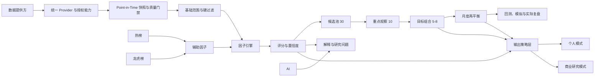
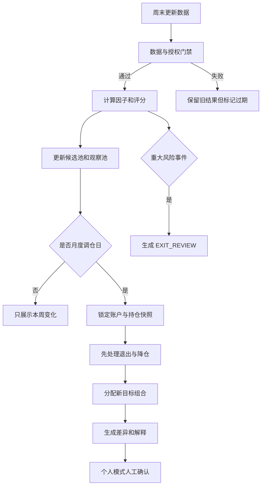

# StockPulse 中长线量化股池与双模式产品设计

**日期：** 2026-08-10
**状态：** 已确认设计，等待实施计划
**目标仓库：** `D:\my-projects\stock-analysis-hub`

## 1. 执行摘要

本次改造保留 `stock-analysis-hub` 的 Vue 3、FastAPI、SQLite、行情 Provider、数据健康、账户持仓、审计、回测和部署能力，将产品主线从“热榜与次日条件交易”调整为“持有 3～12 个月的中长线量化股池研究与组合管理”。

系统以沪深 300 与中证 500 的历史成分股为基础范围，并允许用户手工加入观察股。每周更新数据和评分，每月生成正式调仓计划；重大财务、治理或交易风险事件不等待月度周期。目标组合持有 5～8 只股票，允许保留现金，不为了满仓而纳入低质量股票。

第一版采用一个可解释的质量成长均衡策略：质量 30%、成长 25%、估值 20%、中期趋势 20%、辅助信号最多 5%。热榜、龙虎榜只能作为经验证的辅助因子，AI 只负责解释和提出研究问题，不能修改分数、策略版本或组合结果。

产品保留单体部署，但按数据、研究、组合、验证和交付策略划分清晰边界。借鉴 vn.py Alpha 与 Qlib 的研究分层，不整体迁移到 vn.py，也不在第一版引入券商网关、事件驱动交易引擎、机器学习黑箱模型或自动下单。

## 2. 已确认的产品决策

| 决策项 | 结论 |
|---|---|
| 投资周期 | 持有 3～12 个月 |
| 基础范围 | 沪深 300 + 中证 500 历史成分，并支持手工观察股 |
| 股池漏斗 | 约 800 只基础范围 → 约 30 只候选 → 约 10 只重点观察 → 5～8 只持仓 |
| 组合数量 | 5～8 只，允许现金 |
| 更新频率 | 每周更新评分，每月正式调仓 |
| 临时处理 | 重大风险事件随时进入人工退出流程 |
| 策略风格 | 质量成长均衡型 |
| 数据路线 | 自用验证期使用免费或低成本数据；商业收费前替换为有商业授权的数据源 |
| 技术路线 | 保留现有项目，渐进式重构；借鉴开源架构，不整体依赖 vn.py |
| 产品模式 | 个人模式 + 商业研究模式 |
| 商业交付 | 私有部署、数据接入、定制和年度维护优先 |
| 自动交易 | 不接券商、不自动下单 |

本文中的门槛和权重是第一版默认值，必须进入策略版本，不得作为散落在代码中的永久常量。已激活版本冻结；任何修改都通过复制旧版本、生成新草稿、重新验证和人工激活完成。

## 3. 当前项目为何让用户缺少主线

现有仓库已经包含三套不同目标的能力：

1. 热榜、OCR、龙虎榜和 AI 复盘等内容型研究工具；
2. MA20/MA60、20 日突破、ATR 止损和次日条件单等中短线趋势工具；
3. 账户、持仓、成交、回测、调度、备份和数据健康等通用基础设施。

问题不是功能缺失，而是不同投资周期和用户任务同时占据一级导航。现有交易策略的核心是 20 日突破和短周期风险控制，与 3～12 个月的基本面量化股池不一致。继续向 `backend/trading/repository.py`、`plan_service.py`、`backtest_service.py` 和统一路由叠加功能，会进一步放大理解与维护成本。

本设计采用“一条主线、两类辅助、一个历史区”的整理原则：

- **唯一主线：** 数据 → 硬过滤 → 因子 → 评分 → 股池 → 组合 → 调仓 → 验证；
- **研究辅助：** 热榜、龙虎榜和 AI 解释；
- **通用基础：** 账户持仓、审计、回测、数据健康、调度和备份；
- **历史能力：** OCR 主流程、次日突破单、追高价和短线 ATR 策略默认隐藏，但迁移期不删除数据。

## 4. 目标与非目标

### 4.1 产品目标

- 让用户一眼看懂本周股池发生了什么、为什么变化、何时需要处理；
- 使用可追溯的财务、估值和价格数据生成量化候选池；
- 给个人模式生成 5～8 只目标组合、目标仓位和月度调仓差异；
- 给商业研究模式提供评分、风险、证据和验证结果，不输出客户账户的具体交易指令；
- 保存数据快照、因子版本、策略版本、评分结果、组合决策和人工确认；
- 支持滚动样本外回测和至少 6 个月模拟观察；
- 数据或授权不满足时显式阻断，绝不静默回退演示数据。

### 4.2 第一版明确不做

- 券商连接、自动委托、撤单或账户托管；
- 高频、分钟或 Tick 级策略；
- 直接依赖整套 vn.py Trader、Gateway 或事件引擎；
- 自动机器学习选模、强化学习或 AI 自动调参；
- 复杂协方差矩阵优化、杠杆和做空；
- 面向公众的实时荐股订阅；
- 对收益率、胜率或回撤作保证。

## 5. 开源方案映入方式

### 5.1 vn.py Alpha

截至 2026-08-08 核对官方仓库，vn.py 主仓库采用 MIT 许可证，`vnpy.alpha` 提供 dataset、model、strategy、lab 等研究分层，并支持截面多标的策略。StockPulse 借鉴以下思想：

- 数据集和特征计算分离；
- 因子定义可注册、可版本化；
- 研究实验与正式策略激活分离；
- 截面多标的排序与组合研究分离；
- 统一实验记录和可重复运行。

第一版不复制 vn.py 的交易主循环、桌面 UI、Gateway、CTA、算法交易和自动执行模块。

### 5.2 Qlib

截至 2026-08-08 核对官方仓库，Qlib 采用 MIT 许可证。StockPulse 借鉴以下思想：

- Point-in-Time 数据处理；
- 因子表达、数据处理、模型、回测和记录的流水线；
- 滚动训练或滚动验证；
- 因子分层、截面排序和组合构建；
- 从研究草稿到生产候选的版本门禁。

第一版不直接引入 Qlib 的全部数据格式和机器学习依赖。若后续验证需要，可以在稳定接口之后增加独立研究适配器。

### 5.3 许可证管理

- 如果只借鉴架构思想，不复制代码，在设计文档中保留来源说明；
- 如果复制或改写 MIT 代码，必须保留原始版权和许可证文本；
- 仓库增加第三方组件清单和 `THIRD_PARTY_NOTICES`；
- 当前仓库根目录没有产品许可证。对外分发前必须明确自有代码授权方式；
- 开源代码许可不等于行情和财务数据许可。数据授权单独管理；
- 每次发布生成依赖许可证清单，禁止将来源不明或禁止商业使用的代码、模型、数据打包交付。

## 6. 总体架构



### 6.1 单体内的清晰边界

新能力放入 `backend/investment/`，仍与现有 FastAPI 一起部署：

```text
backend/investment/
  api/                 # 新 /api/investment/* 路由
  data/                # Provider、授权、快照、质量门禁
  universe/            # 指数成分、手工观察、硬过滤
  factors/             # 因子定义、计算、标准化
  scoring/             # 权重、置信度、版本化评分
  portfolio/           # 组合约束和目标权重
  rebalance/           # 周更新、月度调仓、例外事件
  validation/          # 回测、滚动验证、模拟观察门禁
  delivery/            # 个人/商业研究输出策略
  repositories/        # 按领域拆分的数据访问
  legacy_adapters/     # 旧 trading、热榜、龙虎榜的适配器
```

`backend/trading/` 在迁移期继续运行。新模块通过端口接口复用账户、持仓、成交、行情、审计和回测基础，不直接调用旧模块的内部 SQL。旧 `/api/trading/*` 保留兼容期，新产品使用 `/api/investment/*`。

### 6.2 模块约束

- `data` 不知道评分权重；
- `factors` 只计算因子，不决定入池；
- `scoring` 只根据锁定版本计算，不读取当前 UI 配置；
- `portfolio` 不修改分数，只执行数量、行业和仓位约束；
- `delivery` 只裁剪输出字段，不重新计算研究结果；
- `legacy_adapters` 只能向新接口提供辅助数据，不得反向污染核心规则。

## 7. 数据设计

### 7.1 Provider 能力

拆分以下只读接口：

- `MarketDataProvider`：日线、复权因子、交易状态；
- `FundamentalDataProvider`：财务报表、财务指标和实际披露时间；
- `ValuationDataProvider`：每日或月末估值截面；
- `IndexMembershipProvider`：历史指数成分及生效区间；
- `CorporateActionProvider`：分红、送转、配股等公司行动；
- `RiskEventProvider`：ST、退市、监管和审计风险事件。

免费数据和未来商业数据必须实现同一领域契约。切换 Provider 不改变因子、股池和组合接口。

### 7.2 数据授权能力

每个数据源记录以下能力：

```text
personal_use
commercial_display
derived_score_use
raw_export
redistribution
expires_at
license_reference
```

商业研究模式在运行时检查授权。缺少 `commercial_display` 时，不展示原始数据；缺少 `derived_score_use` 时，不允许基于该源生成商业评分；缺少 `raw_export` 时，禁用对应导出。

### 7.3 Point-in-Time 快照

每条财务和指数成分数据至少保存：

```text
instrument
period_end
published_at
effective_from
effective_to
retrieved_at
provider
provider_version
raw_hash
license_id
quality_status
```

评分日只能读取 `published_at <= score_date` 且当时有效的数据。历史回测禁止用当前指数成分倒推过去。

### 7.4 数据错误处理

- 关键财报缺失、过期或披露时间不可确认：该股票本期 `BLOCKED`；
- 指数成分历史缺失：禁止运行正式历史回测；
- 复权、价格或财报来源冲突：记录冲突并阻断相关因子；
- 非关键字段缺失：降低置信度，不把缺失值当作 0，也不跨维度重分配权重；
- Provider 临时失败：保留上一期结果供查看，但标记过期，不生成新的评分与调仓；
- 演示数据只存在于显式 Demo 环境，生产与个人正式模式不得静默回退。

## 8. 基础范围与硬过滤

### 8.1 基础范围

- 沪深 300 与中证 500 当期有效成分；
- 用户手工观察股；
- 历史回测使用每个历史日期当时有效的指数成分；
- 手工观察股保留来源和加入理由，不自动获得评分加成。

### 8.2 第一版硬过滤默认值

以下条件任一命中即不参与正常评分：

- ST、退市整理、长期停牌或无法正常成交；
- 上市不足 24 个月；
- 近 60 个交易日日均成交额低于 5000 万元；
- 净资产为负；
- 最近年度审计意见为否定或无法表示意见；
- 关键财务报表、披露日或复权数据缺失；
- 已确认的财务造假、重大治理风险或退市风险；
- 数据质量门禁为 `BLOCKED`。

流动性、上市时间和财务门槛进入策略版本，可根据回测和模拟证据生成新版本，不能在激活版本中直接修改。

## 9. 因子和评分模型

### 9.1 质量 30 分

| 子因子 | 分值 | 设计意图 |
|---|---:|---|
| ROE/ROIC 水平与稳定性 | 8 | 衡量资本使用效率，避免只看单期高值 |
| 经营现金流与利润匹配 | 7 | 识别利润含金量和自由现金流能力 |
| 毛利率与经营利润率稳定性 | 5 | 识别商业模式稳定性 |
| 杠杆与偿债能力 | 5 | 控制财务脆弱性 |
| 应收、存货、减值和应计风险 | 5 | 识别利润质量恶化 |

金融、地产和其他特殊行业使用独立因子模板，不机械套用工业企业的现金流和杠杆指标。

### 9.2 成长 25 分

| 子因子 | 分值 | 设计意图 |
|---|---:|---|
| 3 年营收复合增长 | 7 | 衡量业务扩张 |
| 3 年扣非利润复合增长 | 7 | 衡量核心利润增长 |
| TTM 与最近季度同比趋势 | 5 | 识别增长延续或减速 |
| 增长连续性 | 4 | 降低单期爆发带来的误判 |
| 一次性收益惩罚 | 2 | 防止非经常性损益伪装成长 |

周期行业按完整周期解释增长，不因低基数反弹获得不受约束的高分。

### 9.3 估值 20 分

| 子因子 | 分值 | 设计意图 |
|---|---:|---|
| 行业内相对估值 | 8 | PE、PB、PS、EV/EBITDA 按行业模板选择 |
| 个股历史估值分位 | 6 | 与自身历史区间比较 |
| 成长与估值匹配 | 4 | 避免只追求绝对低估值 |
| 现金流或股东回报率 | 2 | 增加真实回报约束 |

亏损公司不强行计算 PE；缺少适用估值指标时降低置信度或阻断估值维度，不用无意义的替代值。

### 9.4 中期趋势 20 分

| 子因子 | 分值 | 设计意图 |
|---|---:|---|
| MA60/MA120 结构与斜率 | 6 | 判断中期趋势是否形成 |
| 6 个月与 12 个月相对强弱 | 8 | 与中证 800 或行业基准比较 |
| 120 日最大回撤与修复 | 4 | 控制趋势脆弱性 |
| 量价稳定性 | 2 | 排除极端拉升和流动性异常 |

现有 MA20、20 日突破、次日追高价和短线 ATR 止损不进入中长线主策略。

### 9.5 辅助信号最多 5 分

- 热榜和龙虎榜必须先有独立历史验证，才可以提供最多 5 分的合计微调；
- 辅助信号无法使硬过滤失败的股票重新进入股池；
- AI 不计分，只解释因子、风险和变化，或提出待人工验证的研究问题；
- 未通过验证时，热榜与龙虎榜只作为详情页证据，不进入总分。

### 9.6 标准化与置信度

计算流程固定为：

1. 锁定评分日和数据快照；
2. 运行硬过滤；
3. 对连续变量执行缩尾或稳健异常值处理；
4. 在适用行业内计算分位或稳健标准分；
5. 按因子版本映射到 0～100；
6. 汇总五个维度并生成置信度；
7. 保存因子输入、结果、规则命中和数据哈希。

总分门槛默认如下：

- `score >= 75`：候选池；
- `65 <= score < 75`：观察池；
- `score < 65`：不进入中长线主池；
- 关键数据缺失或硬过滤失败：`BLOCKED`，不生成总分。

## 10. 股池与组合构建

### 10.1 四层股池

1. **基础范围：** 约 800 只指数成分和手工观察股；
2. **候选池：** 评分不低于 75，按分数和置信度选择约 30 只；
3. **重点观察池：** 在组合约束和持续性条件下选择约 10 只；
4. **目标组合：** 选择 5～8 只，允许现金。

### 10.2 入选缓冲

进入目标组合必须同时满足：

- 连续两次周评分处于候选状态；
- 分数不低于 75；
- 无硬过滤和重大风险事件；
- 数据置信度达到策略门槛；
- 满足行业、数量和单股上限；
- 月度调仓日仍然有效。

### 10.3 持有缓冲

当前持仓不因一两名排名变化被立即替换。满足以下条件可继续持有：

- 分数不低于 65；
- 基本面主逻辑未破坏；
- 没有重大风险事件；
- 行业和组合暴露仍可接受。

这种进入 75、持有 65 的双门槛用于降低无意义换手，不是为了掩盖策略失效。

### 10.4 退出规则

- 重大财务、治理、退市或交易风险：立即生成 `EXIT_REVIEW`，由个人模式人工确认处理；
- 连续两周低于 65：月度调仓退出；
- 质量或成长维度显著恶化：月度调仓降低仓位或退出；
- 中期趋势破坏且基本面无法支撑：月度调仓退出；
- 商业研究模式只显示风险和池状态变化，不生成客户账户买卖指令。

### 10.5 目标权重

- 目标持仓 5～8 只；
- 默认使用简单等权基线；
- 单股目标上限 20%；
- 同一一级行业最多 2 只，目标行业暴露不超过 30%；
- 不使用杠杆；
- 默认至少保留 10% 现金；候选不足或市场风险偏高时允许更多现金；
- 现有市场状态模型只能降低总暴露，不能提升低分股票或修改因子分数。

第一版不使用均值方差、风险平价或黑箱优化器。真实样本积累后，任何新优化方法作为独立策略版本验证。

## 11. 更新与调仓流程



- 每周任务更新数据、因子、评分、风险和股池；
- 每月第一个交易日生成正式调仓计划，具体交易日通过配置决定；
- 计划使用锁定的策略版本、数据快照、股池版本和账户快照；
- 同一输入重复运行必须返回同一结果；
- 输入变化生成新版本并保留旧结果，不覆盖历史；
- 调仓结果优先展示“为什么退出”，再展示“为什么进入”。

## 12. 回测与验证门禁

### 12.1 策略状态

```text
DRAFT -> BACKTESTED -> OBSERVATION -> PERSONAL_ACTIVE -> RETIRED
```

- `DRAFT`：可修改，不产生正式调仓；
- `BACKTESTED`：完成滚动样本外验证，但只能用于研究；
- `OBSERVATION`：至少连续 6 个月模拟观察；
- `PERSONAL_ACTIVE`：个人用户人工激活；
- `RETIRED`：保留历史，不再生成新结果。

商业研究发布还必须通过数据授权、输出策略和法律合规检查，不因个人激活自动开放。

### 12.2 回测约束

- 使用历史时点的指数成分、财报披露日、复权和风险状态；
- 周末计算评分，月度调仓在下一可交易日按保守价格成交；
- 计入佣金、税费、滑点、停牌和涨跌停不可成交；
- 使用至少 8 年历史且覆盖不少于 3 种市场阶段，数据不足则不允许标记为正式通过；
- 使用滚动样本外验证，禁止在全部历史上反复选择最优权重；
- 对交易成本、调仓日、进入门槛和持有门槛做敏感性分析；
- 与中证 800、基础范围等权组合和纯趋势基线比较。

### 12.3 必须输出的验证指标

- 年化收益、累计收益和超额收益；
- 最大回撤、Calmar、波动率和下行风险；
- 月度换手率、交易成本和不可成交比例；
- 因子分层单调性、Rank IC 及稳定性；
- 行业集中度、个股集中度和收益贡献来源；
- 牛市、熊市、震荡市和不同年份的表现；
- 候选池命中率、持有周期分布和退出原因；
- 参数轻微变化后的结果稳定性。

通过门禁不代表未来盈利，只代表具备进入模拟观察的工程与研究资格。

## 13. Web 信息架构

一级导航收缩为七个页面：

1. **概览：** 本周候选变化、当前组合、风险、数据状态和下次调仓日；
2. **量化股池：** 基础、候选、观察和持仓四层切换，显示分数与置信度；
3. **个股研究：** 因子分解、财务趋势、估值分位、中期趋势、数据来源和风险；
4. **组合与调仓：** 当前持仓、目标权重、新旧差异、退出优先和人工确认；
5. **回测与验证：** 策略版本、基准对照、分阶段表现、成本和稳定性；
6. **数据健康：** Provider、快照日期、缺失、冲突、授权和任务状态；
7. **策略版本：** 权重、门槛、状态、回测证据、激活和回退。

热榜、龙虎榜和 AI 分析不再作为平行一级主线，统一放入个股研究的“辅助证据”区域或独立的历史研究入口。OCR 和旧中短线页面在迁移期通过“历史工具”入口访问，默认不展示。

页面首先呈现原始事实和变化，再呈现解释。任何候选都必须能展开查看：

- 因子分数与原始输入；
- 与行业和历史分位的比较；
- 进入或退出规则；
- 数据日期、Provider、质量和授权；
- 策略版本和评分运行编号；
- AI 解释与确定性规则结果明确分区。

## 14. 个人模式与商业研究模式

### 14.1 个人模式

个人模式可以展示：

- 5～8 只目标组合；
- 目标仓位、调仓差异和人工确认计划；
- 用户自己的持仓、成交、净值和执行偏差；
- 风险事件处理和实际复盘。

### 14.2 商业研究模式

商业研究模式只展示：

- 候选池、观察池和池状态变化；
- 因子分解、评分、置信度和风险提示；
- 历史验证、策略说明和研究报告；
- 已获授权的数据或允许展示的衍生结果。

默认隐藏：

- 针对客户账户的目标仓位；
- 个性化买入、卖出数量和交易指令；
- 未经授权的原始行情或财务数据导出；
- 收益承诺、胜率承诺和确定性预测。

输出隔离在 `delivery` 层实现，并由服务端控制；前端隐藏按钮不是安全边界。

### 14.3 推荐商业化方式

第一阶段不做公开订阅荐股平台，优先提供：

1. 私有部署许可；
2. 安装、升级、备份和年度维护；
3. 合规数据源接入；
4. 企业内部研究流程定制；
5. 因子、报表和权限模块定制；
6. 培训、部署验收和运维支持。

在中国境内对外提供个性化证券投资建议可能涉及证券投资咨询等监管要求。商业上线前必须由具备资格的法律和合规人员审查实际功能、宣传、合同、数据授权和客户范围。本设计不是法律意见。

## 15. 数据库增量设计

保留现有 `trade_*` 账户、持仓、成交、行情、策略、回测和审计数据。新增或扩展以下领域表，具体 DDL 在实施计划阶段设计：

| 表或聚合 | 作用 |
|---|---|
| `trade_index_membership_snapshots` | 历史指数成分与生效区间 |
| `trade_fundamental_snapshots` | 财务数据与披露时间 |
| `trade_valuation_snapshots` | 估值截面和来源 |
| `trade_risk_events` | ST、监管、审计和治理事件 |
| `trade_data_licenses` | Provider 授权能力和有效期 |
| `trade_factor_definitions` | 因子定义、行业模板和版本 |
| `trade_factor_values` | 单股票、单日期、单因子结果和置信度 |
| `trade_score_runs` / `trade_score_items` | 评分运行与明细 |
| `trade_pool_snapshots` / `trade_pool_items` | 四层股池快照 |
| `trade_rebalance_runs` / `trade_rebalance_items` | 月度目标组合和差异 |
| `trade_observation_runs` | 模拟观察与门禁状态 |
| `trade_delivery_policies` | 个人/商业输出字段和授权策略 |

大表按 Repository 拆分，禁止继续把所有 SQL 写入一个 50KB 以上的 `repository.py`。

## 16. API 边界

新 API 使用 `/api/investment` 前缀，至少包含：

```text
GET  /overview
GET  /universe
GET  /pools
GET  /stocks/{code}/research
GET  /scores/{run_id}
GET  /portfolio/current
POST /rebalance-runs
GET  /rebalance-runs/{id}
POST /rebalance-runs/{id}/confirm
POST /backtests
GET  /backtests/{id}
GET  /data-health
GET  /strategy-versions
POST /strategy-versions
POST /strategy-versions/{id}/promote
GET  /delivery-mode
```

所有返回体包含 `as_of`、`strategy_version`、`data_status` 和 `trace_id`。商业研究模式由认证后的服务端策略裁剪字段。

## 17. 安全、审计与运行约束

- 个人与商业模式必须通过服务端身份和授权区分；
- 调仓确认、策略晋升、手工风险覆盖和数据源切换写审计日志；
- Provider Token、商业数据凭据和客户数据不得进入前端、数据库普通字段或日志；
- 公网部署必须使用 HTTPS、认证和最小权限；
- 商业客户数据库默认独立，不在不同客户间共享账户、持仓或研究记录；
- 数据导出按授权能力控制，并记录导出人、时间、范围和用途；
- AI 输入默认不包含客户账户和未授权原始数据；
- 策略失败、数据失败和授权失败均采用 fail-closed。

## 18. 测试与验收

### 18.1 单元测试

- 每个因子公式、边界、行业模板和缺失值处理；
- 缩尾、行业分位、标准化和置信度；
- 75/65 双门槛和连续两周缓冲；
- 5～8 只、单股 20%、行业 2 只/30% 和现金约束；
- 个人/商业输出字段隔离；
- 策略版本不可变和状态转换。

### 18.2 数据与防未来函数测试

- 评分日不能读取之后披露的财报；
- 历史指数成分不能使用当前成员；
- 复权和公司行动在生效日正确应用；
- Provider 切换不改变领域数据含义；
- 缺失、冲突、过期和授权不足必须阻断；
- Demo 数据不进入正式运行。

### 18.3 回测测试

- 下一交易日成交、费用、滑点和不可成交规则；
- 月度调仓与周评分时序；
- 同一快照和版本产生确定性结果；
- 滚动样本外区间严格隔离；
- 参数敏感性和基准比较可重复。

### 18.4 前端与端到端测试

- 从数据更新到候选池、个股研究、组合差异和人工确认的主流程；
- 数据阻断时页面展示原因且不能生成正式调仓；
- 商业研究模式看不到个人目标仓位和交易指令；
- 策略版本晋升必须展示证据并二次确认；
- 移动端和窄屏下关键分数、风险、日期与来源不被截断。

### 18.5 第一版验收标准

- 约 800 只基础范围可以在周任务内完成快照、过滤、评分和股池更新；
- 任意候选股票可以追溯到因子输入、来源、日期、策略版本和规则；
- 同一数据快照与策略版本重复运行结果完全一致；
- 数据错误不会产生新的正式评分或调仓计划；
- 候选池约 30 只、重点观察约 10 只、目标组合 5～8 只；
- 个人模式和商业研究模式通过自动化测试证明字段隔离；
- 旧中短线策略、热榜和 AI 不能绕过核心过滤与评分；
- 完成不少于 8 年的 Point-in-Time 回测后，才能进入至少 6 个月模拟观察。

## 19. 渐进迁移顺序

### 阶段 0：保护现状

- 生成完整代码、数据库、配置和运行制品备份；
- 验证备份可恢复后才执行迁移；
- 固化现有测试、接口和数据库基线；
- 对现有功能标记保留、适配、隐藏和历史四种状态。

### 阶段 1：建立新边界

- 创建 `backend/investment` 和 `/api/investment`；
- 建立 Provider、快照、授权、因子和输出策略接口；
- 为旧行情、账户、持仓和审计建立适配器；
- 不改变现有页面默认行为。

### 阶段 2：数据与评分

- 实现指数成分、财务、估值、风险事件和 Point-in-Time 快照；
- 实现硬过滤、因子、行业标准化、置信度和评分版本；
- 生成基础、候选和观察股池。

### 阶段 3：组合与调仓

- 实现 5～8 只组合、行业约束、现金和双门槛缓冲；
- 实现周更新、月度再平衡和风险例外；
- 复用账户持仓并生成新旧目标差异。

### 阶段 4：验证体系

- 扩展现有回测为 Point-in-Time 截面组合回测；
- 实现滚动样本外、基准、成本、因子分层和策略晋升；
- 实现至少 6 个月模拟观察记录。

### 阶段 5：Web 主线和双模式

- 上线七页信息架构；
- 将热榜、龙虎榜和 AI 移入辅助证据；
- 将旧 OCR 和中短线页面移入历史工具；
- 实现服务端个人/商业字段隔离。

### 阶段 6：商业准备

- 增加产品许可证和第三方通知；
- 接入具有商业授权的数据源；
- 完成安全、数据授权和法律合规审查；
- 建立私有部署、升级、备份、维护和验收流程。

## 20. 关键风险与控制

| 风险 | 控制方式 |
|---|---|
| 免费数据不稳定 | Provider 契约、缓存、质量门禁、显式失败 |
| 财务数据未来函数 | 保存披露时间并按评分日查询 |
| 幸存者偏差 | 使用历史指数成分快照 |
| 过拟合 | 单策略、滚动样本外、参数敏感性、模拟观察 |
| 换手过高 | 周评分、月调仓、75/65 双门槛、连续两周确认 |
| 行业集中 | 同行业最多 2 只、目标暴露不超过 30% |
| 黑箱难解释 | 第一版无 ML 黑箱，保存所有因子输入和规则 |
| 开源许可遗漏 | 第三方清单、MIT 通知、发布扫描 |
| 数据商业授权不足 | 授权能力模型、服务端输出控制、商业前替换数据源 |
| 涉及投资咨询监管 | 商业研究模式限制输出，正式上线前专业合规审查 |
| 继续堆叠巨型文件 | 新领域目录和分仓 Repository，旧模块只通过适配器接入 |

## 21. 设计完成标准

本设计视为完成，因为它已经明确：

- 产品用户、投资周期、股池范围、持仓数量和调仓节奏；
- 数据来源阶段、商业授权边界和错误处理；
- 开源方案的借鉴范围和许可证处理；
- 硬过滤、因子、权重、评分、置信度和版本治理；
- 股池漏斗、组合约束、入选缓冲和退出规则；
- 回测、样本外验证、模拟观察和策略晋升；
- 个人模式、商业研究模式和推荐商业化方式；
- 目标模块、API、数据库增量、UI、测试和迁移顺序；
- 第一版明确不做的能力与商业合规前置条件。

下一步不是直接写代码，而是基于本文生成可执行的实施计划，将每个阶段拆成小任务、测试、验证命令和回滚点。
